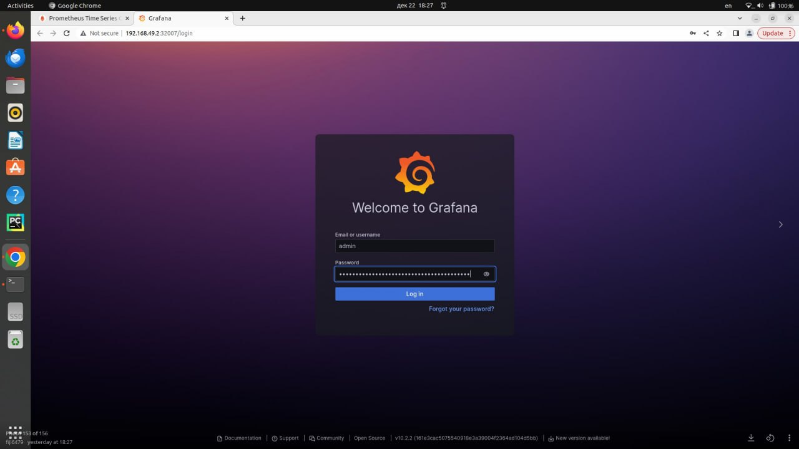

# Лабораторная работ №4

## Цель работы

Сделать мониторинг сервиса поднятого в Kubernetes с помощью prometheus и grafana

## Ход работы

### Установка Prometheus.

Для этого с помощью следующией команды скопируем репозиторий.

```
helm repo add prometheus-community https://prometheus-community.github.io/helm-charts
```


После этого установим сервис Prometheus

```
helm install prometheus prometheus-community/prometheus
```


Теперь запустим Prometheus

```
kubectl expose service prometheus-server --type=NodePort --target-port=9090 --name=prometheus-server-np
```

Введем следующую команду для того чтобы открылся веб-интерфейс с Prometheus:

```
minikube service prometheus-server-np
```


### Установка Grafana

Настройка grafana похожа с настройкой Prometheus.

Сначала скопируем репозиторий Grafana:

```
helm repo add grafana https://grafana.github.io/helm-charts
```


После этого установим сам сервис Grafana

```
helm install grafana grafana/grafana
```


Теперь запустим Grafana и поднимем веб-интерфейс, для этого воспользуемся следующими командами:

```
kubectl expose service grafana --type=NodePort --target-port=3000 --name=grafana-np
minikube service grafana-np
```


Как только мы выполним эти команды, мы получим следующую страницу:



Для того чтобы получить пароль от аккаунта админ требуется написать следующую команду:


Как только мы вошли в аккаунт admin мы получили следующее меню:


### Отображение графиков

Для того чтобы отобразить графики нужно подключить Prometheus к нашему Grafana. Поэтому переходим в Connections, Data Sources и в Connections укажем ip Prometheus.


После этого нам предлагают создать самим Dashboard или импортировать из официальной базы данных Dashboards. Для этого перейдем на сайт grafana и выберем Node Exporter Full (https://grafana.com/grafana/dashboards/1860-node-exporter-full/)


Теперь скопируем id этой Dashboards и получим следующий результат.


## Вывод

В ходе выполнения лабораторной работы мы связали Prometheus и Grafana в одном Kubernetes. В результате мы оторбразили состояние компьютера ввиде нескольких графиков.
